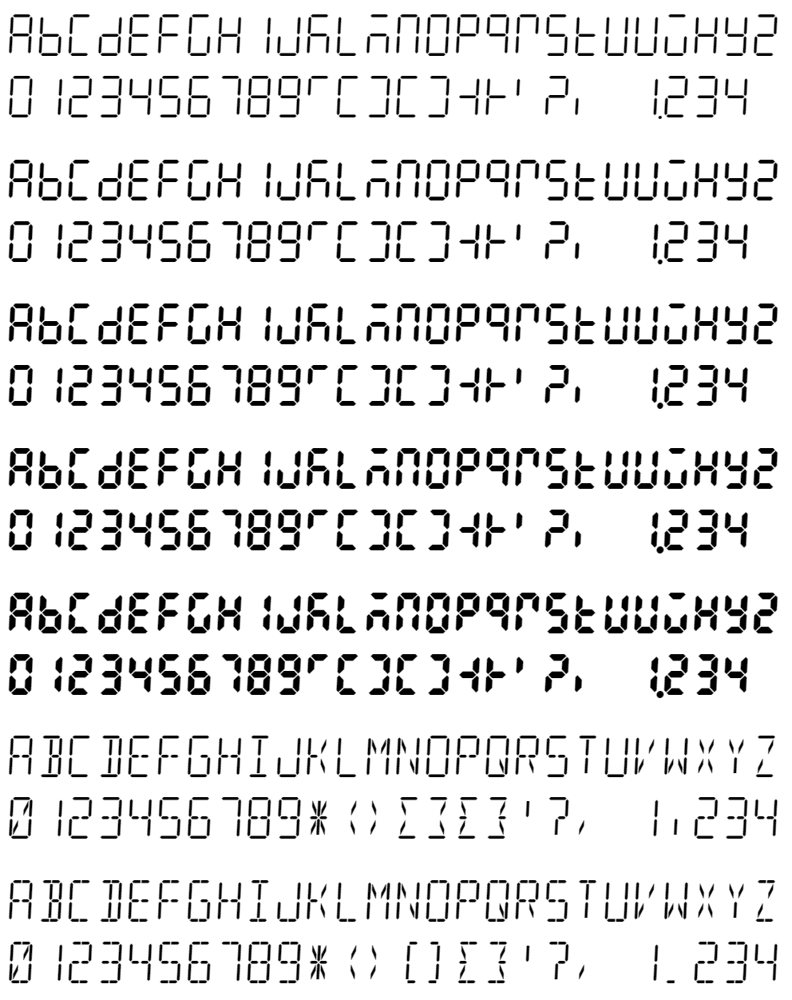

# Quixotic

This is a font family for the Quikscript and Shaw (Shavian) alphabets, in the style of 7, 14 and 16-segment displays. They contain the complete ASCII (Basic Latin) character set, the complete Quikscript alphabet in its community-standard Private Use Area encoding, the Shaw alphabet in the Supplementary Multilingual Plane, plus a few other punctuation marks and symbols necessary for typesetting simple documents in English.

## Software requirements

- Ensure Python and FontForge are installed, and both are in your PATH environment variable (so they can be invoked from the command line).
- Ensure FontForge's Python module is accessible to your Python interpreter (it may need to be manually copied into the appropriate location).
- From the root of the repo, run the command `pip -r requirements.txt` to install the necessary Python packages.

## Building

The segment definitions are stored in CSV format. Most other font parameters and characteristics are controlled by `generate.py` and `generate.bat`. To build the fonts from scratch, using the provided Windows batch files:

1. Run `generate.bat`; this produces the intermediate sources in UFO format
2. Run `build.bat`; this builds the final OpenType (TTF and WOFF2) fonts and patches in TTX data to some of them
   - If you wish, run `test.bat` to see Font Bakery's test results for the fonts